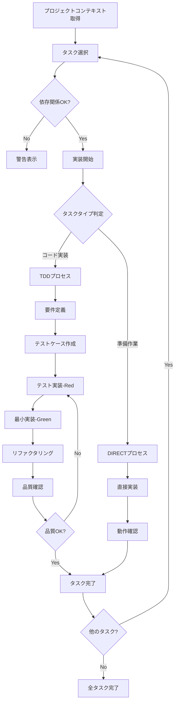

# implement

## 目的

分割されたタスクを順番に、またはユーザが指定したタスクを実装する。t-wada が推奨する TDD プラクティスと必要十分な直接作業で品質の高い実装を行う。

## 使用方法

```bash
# 全タスクを順番に実行(続きから実行)
/implement

```

## 前提条件

- `docs/tasks/{要件名}-overview.md` と各フェーズファイルにタスク一覧が存在する
  - {要件名} を抽出
- `CLAUDE.md` が存在する
- PostgreSQL MCP が利用可能（DB 関連タスクの場合）

## 実行内容

**【信頼性レベル指示】**:
各項目について、元の資料（EARS 要件定義書・設計文書含む）との照合状況を以下の信号でコメントしてください：

- 🟢 **青信号**: EARS 要件定義書・設計文書を参考にしてほぼ推測していない場合
- 🟡 **黄信号**: EARS 要件定義書・設計文書から妥当な推測の場合
- 🔴 **赤信号**: EARS 要件定義書・設計文書にない推測の場合

1. **プロジェクトコンテキストの取得**

   - `CLAUDE.md` と、そこから辿れるファイルを全て読み込み、プロジェクトの技術スタック・開発方針を把握
   - PostgreSQL MCP を使用して現在のデータベース構造を把握（DB 関連タスクの場合）
   - プロジェクトの開発パターン・コーディング規約を理解

2. **タスクの選択**

   - ユーザが指定したタスク ID を確認
   - 指定がない場合は、依存関係に基づいて次のタスクを自動選択
   - `docs/tasks/{要件名}-overview.md` および該当フェーズファイルからタスク詳細を取得
   - 選択したタスクの詳細を表示

3. **依存関係の確認**

   - 依存タスクが完了しているか確認
   - 未完了の依存タスクがある場合は警告
   - 並行実行可能なタスクの識別

4. **実装ディレクトリの準備**

   - 現在のワークスペースで作業を行う
   - プロジェクト構造に応じたディレクトリ構成を確認

5. **実装タイプの判定**

   - タスクの性質を分析（コード実装 vs 準備作業）
   - プロジェクトの技術スタックに応じた実装方式を決定（TDD vs DIRECT）

6. **実装プロセスの実行**

   ### A. **TDD プロセス**（コード実装タスク用）

   **t-wada が推奨する TDD プラクティス**に従って実装：

   a. **要件定義**

   ```
   Task実行: TDD要件定義フェーズ
   目的: タスクの詳細要件を記述し、受け入れ基準を明確化する
   方針: Red-Green-Refactorサイクルの準備
   実行方式: 個別Task実行
   ```

   b. **テストケース作成**

   ```
   Task実行: TDDテストケース作成フェーズ
   目的: テストファーストでテストケースを作成し、エッジケースを考慮する
   方針: 実装前にテストを設計
   実行方式: 個別Task実行
   ```

   c. **テスト実装（Red）**

   ```
   Task実行: TDDレッドフェーズ
   目的: 失敗するテストを実装し、テストが確実に失敗することを確認する
   方針: テストファーストの徹底
   実行方式: 個別Task実行
   ```

   d. **最小実装（Green）**

   ```
   Task実行: TDDグリーンフェーズ
   目的: テストが通る最小限の実装を行い、過度な実装を避ける
   方針: シンプルな実装でテストを通す
   実行方式: 個別Task実行
   ```

   e. **リファクタリング**

   ```
   Task実行: TDDリファクタリングフェーズ
   目的: コードの品質向上と保守性の改善を行う
   方針: 動作を保ちながら構造を改善
   実行方式: 個別Task実行
   ```

   f. **品質確認**

   ```
   Task実行: TDD品質確認フェーズ
   目的: 実装の完成度を確認し、不足があればRed-Green-Refactorを繰り返す
   方針: 継続的な品質改善
   実行方式: 個別Task実行
   ```

   ### B. **DIRECT プロセス**（準備作業タスク用）

   **必要十分な実装と動作確認**を行う：

   a. **直接実装**

   ```
   Task実行: 直接実装フェーズ
   目的: 設定・環境構築等の準備作業を確実に実施
   作業内容:
   - ディレクトリ作成
   - 設定ファイル作成
   - 依存関係のインストール
   - 環境設定
   実行方式: 個別Task実行
   ```

   b. **動作確認**

   ```
   Task実行: 動作確認フェーズ
   目的: 動作確認を徹底し、次のタスクへの影響を防ぐ
   作業内容:
   - 作業完了の検証
   - 期待された成果物の確認
   - 次のタスクへの準備状況確認
   実行方式: 個別Task実行
   ```

7. **タスクの完了処理**

   - タスクのステータスを更新（タスクファイルのチェックボックスにチェックを入れる）
   - 実装結果をドキュメント化
   - 次のタスクを提案

## 実行フロー



## 実装タイプ判定基準

### TDD プロセス（コード実装タスク）

以下の条件に当てはまるタスク：

- 新しいコンポーネント、サービス、関数等の実装
- 既存コードの機能追加・修正
- ビジネスロジックの実装
- API 実装
- データベース操作ロジック

**例**: サービス実装、UI コンポーネント作成、状態管理実装、API 実装

### DIRECT プロセス（準備作業タスク）

以下の条件に当てはまるタスク：

- プロジェクト初期化・環境構築
- ディレクトリ構造作成
- 設定ファイル作成・更新
- 依存関係のインストール
- ツール設定・設定

**例**: プロジェクト初期化、データベース設定、開発環境設定

## 実装方針

### TDD プロセス（t-wada が推奨するプラクティス）

1. **テストファースト**

   - 必ずテストを先に書く
   - テストが失敗することを確認してから実装

2. **Red-Green-Refactor サイクル**

   - 小さなステップで進める
   - 一度に全てを実装しない

3. **継続的な品質確認**

   - 各ステップで品質を確認
   - 技術的負債を作らない

### DIRECT プロセス（必要十分な実装）

1. **段階的実行**

   - 依存関係を考慮した順序で実行
   - 各ステップの完了を確認

2. **動作確認の徹底**

   - 作成した設定ファイルの動作確認
   - 環境の正常性チェック

3. **ドキュメントの更新**

   - 実装と同時にドキュメントも更新
   - 他の開発者が理解できるように

## 出力フォーマット

### タスク開始時（TDD プロセス）

```
🚀 タスク TASK-0001: ユーザー認証API の実装を開始します

📋 タスク詳細:
- 要件: REQ-001, REQ-002
- 依存: TASK-0002 ✅
- 実装タイプ: TDDプロセス
- 技術スタック: {プロジェクトの技術スタック}

🔄 t-wadaが推奨するTDDプラクティスで実装します...
```

### タスク開始時（DIRECT プロセス）

```
🚀 タスク TASK-0003: データベース設定 の実装を開始します

📋 タスク詳細:
- 要件: REQ-402, REQ-006
- 依存: TASK-0001 ✅
- 実装タイプ: DIRECTプロセス
- 技術スタック: {プロジェクトの技術スタック}

🔧 必要十分な実装と動作確認を行います...
```

### 各ステップ完了時（TDD）

```
✅ ステップ 1/6: 要件定義 完了
   実装内容: 詳細要件の明確化と受け入れ基準の定義

🏃 ステップ 2/6: テストケース作成 実行中...
   実行内容: テストファーストでテストケースを作成中
```

### 各ステップ完了時（DIRECT）

```
✅ ステップ 1/2: 直接実装 完了
   作成ファイル: 8個、設定更新: 3個
   実行結果: 環境構築完了

🏃 ステップ 2/2: 動作確認 実行中...
   実行内容: 動作確認フェーズを開始
```

### タスク完了時（TDD）

```
🎉 タスク TASK-0001 が完了しました！

✅ タスクファイルのチェックボックスを更新しました
   - [ ] **タスク完了** → [x] **タスク完了**

📊 実装サマリー:
- 実装タイプ: TDDプロセス (t-wadaプラクティス)
- 実行ステップ: 6個 (全て成功)
- 作成ファイル: 12個
- テストケース: 25個 (全て成功)
- カバレッジ: 95%

📝 次の推奨タスク:
- TASK-0002: ユーザー管理API
- TASK-0101: ログイン画面（依存関係あり）

続けて実装しますか？ (y/n)
```

### タスク完了時（DIRECT）

```
🎉 タスク TASK-0003 が完了しました！

✅ タスクファイルのチェックボックスを更新しました
   - [ ] **タスク完了** → [x] **タスク完了**

📊 実装サマリー:
- 実装タイプ: DIRECTプロセス (必要十分な実装)
- 実行ステップ: 2個 (全て成功)
- 作成ファイル: 8個
- 設定更新: 3個
- 動作確認: 正常

📝 次の推奨タスク:
- TASK-0004: 状態管理設定
- TASK-0101: サービス実装（依存関係あり）

続けて実装しますか？ (y/n)
```

## エラーハンドリング

- **依存タスク未完了**: 警告を表示し、確認を求める
- **テスト失敗**: 詳細なエラー情報を表示し、Red-Green-Refactor サイクルを継続
- **ファイル競合**: バックアップを作成してから上書き
- **環境問題**: プロジェクトの技術スタックに応じた解決策を提示

## 実行後の確認

- プロジェクトコンテキストの取得が成功したことを確認
- 実装したファイルの一覧を表示
- テスト結果のサマリーを表示（TDD プロセスの場合）
- 動作確認結果を表示（DIRECT プロセスの場合）
- 残りのタスクと進捗率を表示
- プロジェクトの技術スタックとの整合性を確認
- 次のタスクの提案を表示
