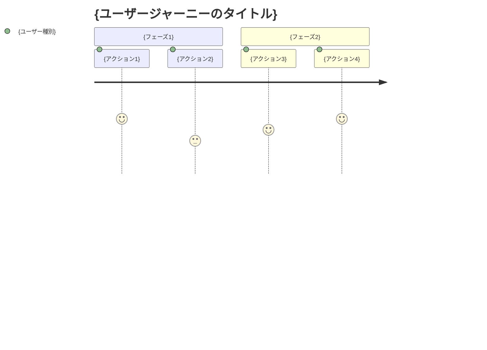

# requirements

## 目的

GitHub issue から提供された要件の概要を分析し、EARS（Easy Approach to Requirements Syntax）記法を使用して詳細な受け入れ基準を含む要件定義書を作成する。

## 使用方法

```bash
/requirements https://github.com/owner/repo/issues/{issue_number}
```

## 前提条件

- GitHub CLI (gh) がインストール・認証済み
- `docs/spec/` ディレクトリが存在する（なければ作成）
- 指定された GitHub issue にアクセス可能

## 実行内容

**【信頼性レベル指示】**:
各項目について、元の資料（EARS 要件定義書・設計文書含む）との照合状況を以下の信号でコメントしてください：

- 🟢 **青信号**: EARS 要件定義書・設計文書を参考にしてほぼ推測していない場合
- 🟡 **黄信号**: EARS 要件定義書・設計文書から妥当な推測の場合
- 🔴 **赤信号**: EARS 要件定義書・設計文書にない推測の場合

1. **GitHub issue の取得**

   - 引数の GitHub issue URL から owner/repo/issue_number を抽出
   - `gh issue view {issue_number} --repo {owner}/{repo} --json title,body,labels,assignees` で issue 情報を取得
   - issue のタイトル、本文、ラベル、アサイニーを要件分析に活用

2. **要件の分析**

   - 取得した issue 情報を基に要件の概要を理解する
   - 関連するドメイン知識を適用する
   - 不明確な点がある場合は、一般的なベストプラクティスに基づいて補完する

3. **ユーザストーリーの作成**

   - WHO（誰が）、WHAT（何を）、WHY（なぜ）の形式で記述
   - 各機能の価値を明確にする

4. **EARS 記法による要件定義**

   - **通常要件（SHALL）**: システムが通常実行すべき動作
   - **条件付き要件（WHEN/IF-THEN）**: 特定の条件下での動作
   - **不要要件（WHERE）**: 特定の状態での動作
   - **オプション要件（MAY）**: 任意の機能
   - **制約要件（MUST）**: システムの制約事項

5. **Edge ケースの定義**

   - 異常系の処理
   - 境界値の処理
   - エラーハンドリング

6. **ファイルの作成**
   - `docs/spec/{要件名}-requirements.md`: 機能要件と関連文書へのリンク
   - `docs/spec/{要件名}-user-stories.md`: 詳細なユーザストーリー
   - `docs/spec/{要件名}-acceptance-criteria.md`: 受け入れ基準とテスト項目
   - マークダウン形式で構造化された文書を作成

## 出力フォーマット例

### 1. requirements.md（メインファイル）

```markdown
# {要件名} 要件定義書

## 概要

{GitHub issue から取得した要件の概要}

**元の GitHub issue**: [{issue_title}]({issue_url})

## 関連文書

- **ユーザストーリー**: [📖 {要件名}-user-stories.md]({要件名}-user-stories.md)
- **受け入れ基準**: [✅ {要件名}-acceptance-criteria.md]({要件名}-acceptance-criteria.md)

## 機能要件（EARS 記法）

### 通常要件

- REQ-001: システムは {通常の動作} しなければならない
- REQ-002: システムは {通常の動作} しなければならない

### 条件付き要件

- REQ-101: {条件} の場合、システムは {動作} しなければならない
- REQ-102: {条件} の場合、システムは {動作} しなければならない

### 状態要件

- REQ-201: {状態} にある場合、システムは {動作} しなければならない

### オプション要件

- REQ-301: システムは {オプション機能} してもよい

### 制約要件

- REQ-401: システムは {制約事項} しなければならない

## Edge ケース

### エラー処理

- EDGE-001: {エラーケース}

### 境界値

- EDGE-101: {境界値ケース}
```

### 2. user-stories.md（詳細なユーザストーリー）

````markdown
# {要件名} ユーザストーリー

## 概要

このドキュメントは{要件名}機能の詳細なユーザストーリーを記載します。

**元の GitHub issue**: [{issue_title}]({issue_url})

## ユーザー種別の定義

### プライマリユーザー

- **エンドユーザー**: {エンドユーザーの詳細説明}
- **管理者**: {管理者の詳細説明}
- **開発者**: {開発者の詳細説明}

### セカンダリユーザー

- **システム管理者**: {システム管理者の詳細説明}
- **外部システム**: {外部システムの詳細説明}

## ユーザストーリー

### 📚 エピック 1: {大きな機能グループ}

#### ストーリー 1.1: {具体的なストーリー名}

**ユーザストーリー**:

- **私は** {ユーザー種別} **として**
- **{具体的な状況・コンテキスト} において**
- **{実現したい行動・操作} をしたい**
- **そうすることで** {得られる価値・解決される問題}

**詳細説明**:

- **背景**: {なぜこの機能が必要なのか}
- **前提条件**: {このストーリーの前提となる状況}
- **利用シーン**: {具体的な利用場面の例}
- **期待する体験**: {ユーザーが期待する体験の詳細}

**関連要件**: REQ-001, REQ-002

**優先度**: 高/中/低

**見積もり**: {ストーリーポイントまたは工数}

#### ストーリー 1.2: {具体的なストーリー名}

{同様の形式で記載}

### 📚 エピック 2: {大きな機能グループ}

{同様の形式で記載}

## ユーザージャーニー

### ジャーニー 1: {代表的な利用フロー}


````

**詳細**:

1. **{アクション 1}**: {詳細な説明}
2. **{アクション 2}**: {詳細な説明}

````

### 3. acceptance-criteria.md（受け入れ基準）

```markdown
# {要件名} 受け入れ基準

## 概要

このドキュメントは{要件名}機能の受け入れ基準とテスト項目を記載します。

**元のGitHub issue**: [{issue_title}]({issue_url})

## 機能テスト基準

### REQ-001: {要件名} の受け入れ基準

**Given（前提条件）**:
- {テスト実行前の状態}
- {必要な初期データ}

**When（実行条件）**:
- {実行するアクション}
- {入力するデータ}

**Then（期待結果）**:
- {期待される出力・状態}
- {確認すべき副作用}

**テストケース**:
- [ ] 正常系: {正常なケースの詳細}
- [ ] 異常系: {異常なケースの詳細}
- [ ] 境界値: {境界値テストの詳細}

### REQ-002: {要件名} の受け入れ基準

{同様の形式で記載}

## Edgeケーステスト基準

### EDGE-001: {エラーケース} の受け入れ基準

**テストシナリオ**:
- {異常な状況の設定}
- {期待されるエラーハンドリング}
- {ユーザーへの適切な通知}

**合格基準**:
- [ ] システムがクラッシュしない
- [ ] 適切なエラーメッセージが表示される
- [ ] データの整合性が保たれる
- [ ] 復旧可能な状態を維持する


````

## 実行後の確認

- GitHub issue の取得が成功したことを確認
- 作成した 3 つのファイルのパスを表示
  - `docs/spec/{要件名}-requirements.md`
  - `docs/spec/{要件名}-user-stories.md`
  - `docs/spec/{要件名}-acceptance-criteria.md`
- 主要な要件の数とユーザストーリー数を報告
- 各ファイル内のリンクが正しく設定されていることを確認
- GitHub issue への適切なリンクが設定されていることを確認
- ユーザに確認を促すメッセージを表示
