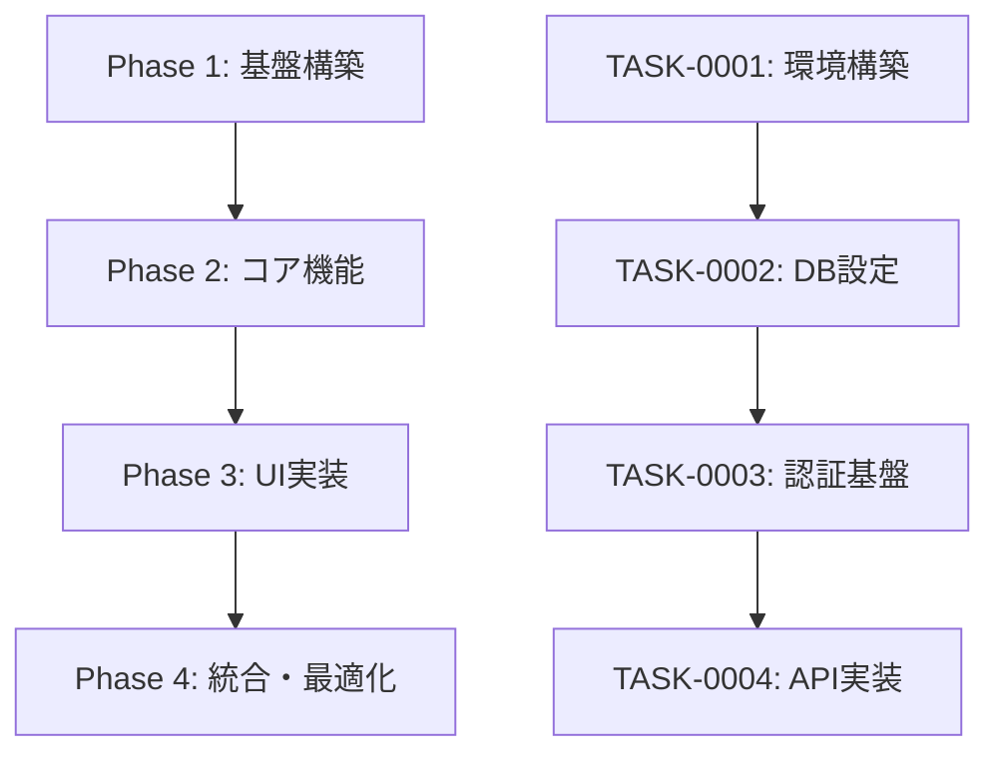

# tasks

## 目的

設計文書に基づいて実装タスクを適切な粒度で分割し、論理的なフェーズに整理する。各フェーズ毎に個別のタスクファイルを作成し、依存関係を考慮した適切な順序で管理する。

## 使用方法

```bash
tasks
```

## 前提条件

- `docs/design/` に設計文書が存在する。{要件名}を抽出。
- 設計がユーザによって承認されている（または承認が省略されている）
- `docs/tasks/` ディレクトリが存在する（なければ作成）
- `CLAUDE.md` が存在し、プロジェクトの技術スタック情報が記載されている
- PostgreSQL MCP が利用可能（DB 関連の設計がある場合）

## 実行内容

**【信頼性レベル指示】**:
各項目について、元の資料（EARS 要件定義書・設計文書含む）との照合状況を以下の信号でコメントしてください：

- 🟢 **青信号**: EARS 要件定義書・設計文書を参考にしてほぼ推測していない場合
- 🟡 **黄信号**: EARS 要件定義書・設計文書から妥当な推測の場合
- 🔴 **赤信号**: EARS 要件定義書・設計文書にない推測の場合

1. **プロジェクトコンテキストの分析**

   - `CLAUDE.md` を読み込み、プロジェクトの技術スタック・開発方針を把握
   - PostgreSQL MCP を使用して現在のデータベース構造を把握（DB 関連設計がある場合）
   - プロジェクトの開発パターン・慣例を理解

2. **設計文書の分析**

   - `docs/design/{要件名}/architecture.md` を読み込み
   - 存在する設計ファイルのみを対象に読み込み：

     - `dataflow.md` （存在する場合）
     - `types.{ext}` （存在する場合）
     - `database-schema.sql` （存在する場合）
     - `api-spec.md` （存在する場合）

3. **既存タスクファイルの確認**

   - 既存の`docs/tasks/{要件名}-*.md`ファイルを確認
   - 使用済みタスク番号（TASK-0001 形式）を抽出
   - 新規タスクで重複しない番号を割り当て

4. **タスクの洗い出し**

   - プロジェクトの技術スタックに応じたタスク分類：

     - 基盤タスク（環境構築、設定など）
     - バックエンドタスク（API 実装、DB 実装など）
     - フロントエンドタスク（UI 実装、コンポーネント実装など）
     - 統合タスク（テスト、デプロイなど）

5. **依存関係の分析**（最重要）

   - タスク間の依存関係を詳細に分析し、実行可能な順序を決定
   - 前提条件が満たされていないタスクの実行を防ぐ
   - 並行実行可能なタスクを識別し、効率的な実行計画を策定
   - クリティカルパス（最長経路）を特定し、ボトルネックを明確化
   - 依存関係の循環参照がないことを確認
   - 各タスクの実行前に必要な成果物・条件を明確化

6. **タスクの詳細化**
   各タスクに以下を含める：

   - タスク ID（TASK-0001 形式の 4 桁番号）
   - タスク名
   - タスクタイプ（TDD/DIRECT）

     - **TDD**: コーディング、ビジネスロジック実装、UI 実装、テスト実装など開発作業
     - **DIRECT**: 環境構築、設定ファイル作成、ドキュメント作成、ビルド設定など準備作業

   - 要件へのリンク
   - 依存タスク
   - 実装詳細
   - 単体テスト要件
   - 統合テスト要件
   - UI/UX 要件（該当する場合）

     - ローディング状態
     - エラー表示
     - レスポンシブ対応
     - アクセシビリティ要件

7. **タスクの順序付け**（最重要）

   - 依存関係に基づいて厳密な実行順序を決定
   - 依存関係違反がないことを複数回検証
   - マイルストーン（節目）を設定し、成果物ベースで進捗の節目を明確化（期日指定は行わない）
   - 並行実行可能なタスクを適切にグループ化
   - 各タスクが実行可能な条件を満たしているかを確認
   - 依存関係グラフを作成し、視覚的に検証

8. **フェーズ分割とファイル作成**

   - タスクを論理的なフェーズに分割
   - 各フェーズ毎に個別のタスクファイルを作成
   - `docs/tasks/{要件名}-overview.md`: 全体概要とフェーズ一覧
   - `docs/tasks/{要件名}-phase1.md`: フェーズ 1 の詳細タスク
   - `docs/tasks/{要件名}-phase2.md`: フェーズ 2 の詳細タスク
   - （以下、フェーズ数に応じて継続）
   - 各タスクを適切な粒度で設計
   - 各タスクにチェックボックスを追加してタスクの完了状況を追跡可能にする

## 出力フォーマット例

### 1. overview\.md（全体概要）

````markdown
# {要件名} 実装タスク全体概要

## プロジェクト概要

- **要件名**: {要件名}
- **総タスク数**: {数}
- **技術スタック**: {CLAUDE.md から取得したスタック情報}

## フェーズ構成

| フェーズ              | 主要成果物           | タスク数  | ファイル               |
| --------------------- | -------------------- | --------- | ---------------------- |
| Phase 1: 基盤構築     | 開発環境・DB 設定    | 20 タスク | [phase1.md](phase1.md) |
| Phase 2: コア機能     | 基本 API・認証       | 22 タスク | [phase2.md](phase2.md) |
| Phase 3: UI 実装      | 画面・コンポーネント | 25 タスク | [phase3.md](phase3.md) |
| Phase 4: 統合・最適化 | テスト・性能調整     | 10 タスク | [phase4.md](phase4.md) |

## 既存タスク番号の管理

**既存ファイル確認結果**:

- 確認したファイル: `docs/tasks/{要件名}-*.md`
- 使用済みタスク番号: TASK-0001 〜 TASK-0077 (例)
- 次回開始番号: TASK-0078

## 依存関係と実行順序



**クリティカルパス**: {最長経路のタスク}
**並行実行可能**: {並行可能なタスクグループ}

## 進捗管理

### 全体進捗

- [ ] Phase 1: 基盤構築 (0/20)
- [ ] Phase 2: コア機能 (0/22)
- [ ] Phase 3: UI 実装 (0/25)
- [ ] Phase 4: 統合・最適化 (0/10)

### マイルストーン（節目／到達条件のみ）

- [ ] M1: 開発環境完成 (Phase 1 完了時)
- [ ] M2: MVP 機能完成 (Phase 2 完了時)
- [ ] M3: UI 完成 (Phase 3 完了時)
- [ ] M4: リリース準備完了 (Phase 4 完了時)

## リスク管理

| リスク       | 影響度   | 発生確率 | 対策       |
| ------------ | -------- | -------- | ---------- |
| {リスク項目} | 高/中/低 | 高/中/低 | {対策内容} |

## 品質基準

- テストカバレッジ: 90%以上
- パフォーマンス: 適切な応答速度
- セキュリティ: プロジェクト標準に準拠
- アクセシビリティ: プロジェクト要件に準拠
````

### 2. phase\*.md（各フェーズ詳細）

```markdown
# {要件名} Phase 1: 基盤構築

## フェーズ概要

- **目標**: 開発環境とデータベース基盤の構築
- **成果物**: 動作する開発環境、データベーススキーマ、CI/CD 基盤
- **技術スタック**: {プロジェクトの技術スタック}

## 実装方針

### TDD タスクの実装方針

- **t-wada が推奨する TDD プラクティス**に従って実装
- テストファーストで開発を進める
- Red-Green-Refactor サイクルを厳守
- 単体テスト・統合テストを適切に実装

### DIRECT タスクの実装方針

- **必要十分な実装と動作確認**を行う
- 設定・環境構築等の準備作業を確実に実施
- 動作確認を徹底し、次のタスクへの影響を防ぐ

## 実行計画

### Stage 1: 環境構築

- **目標**: 基本的な開発環境の構築
- **成果物**: 開発環境、基本設定

### Stage 2: データベース設計

- **目標**: データベーススキーマの実装
- **成果物**: DB 設計、マイグレーション

### Stage 3: CI/CD 構築

- **目標**: 自動化パイプラインの構築
- **成果物**: テスト・デプロイ自動化

### Stage 4: 基盤テスト・調整

- **目標**: 基盤の安定化
- **成果物**: 動作確認済み基盤

## タスク詳細

### Stage 1: 環境構築

#### Task 1 (TASK-0001): プロジェクト初期化

- [ ] **タスク完了**
- **タスクタイプ**: DIRECT
- **要件リンク**: REQ-001
- **依存タスク**: なし
- **実装詳細**:
  - {プロジェクトの技術スタック}環境設定
  - 設定ファイル作成
  - リンター・フォーマッター設定
  - バージョン管理初期化
- **完了条件**:
  - [ ] 開発サーバーが起動する
  - [ ] リンターでエラーが出ない
  - [ ] 設定が正しく動作する
- **注意事項**: プロジェクト標準に準拠すること

#### Task 2 (TASK-0002): 開発環境構築

- [ ] **タスク完了**
- **タスクタイプ**: DIRECT
- **要件リンク**: REQ-002
- **依存タスク**: TASK-0001
- **実装詳細**:
  - コンテナ環境設定（該当する場合）
  - データベース環境設定
  - 環境変数管理設定
  - 開発ツール設定
- **完了条件**:
  - [ ] 全サービスが起動する
  - [ ] アプリケーションから DB 接続できる
  - [ ] ホットリロードが動作する（該当する場合）
- **注意事項**: ポート競合に注意すること

#### Task 3 (TASK-0003): プロジェクト構造構築

- [ ] **タスク完了**
- **タスクタイプ**: DIRECT
- **要件リンク**: REQ-003
- **依存タスク**: TASK-0002
- **実装詳細**:
  - ディレクトリ構造作成
  - テストディレクトリ構造
  - 設定ファイル配置
  - ドキュメント作成
- **完了条件**:
  - [ ] プロジェクト標準に沿った構造
  - [ ] テストファイルの配置が正しい
  - [ ] ドキュメントが充実している
- **注意事項**: 後から変更しにくい構造のため慎重に設計

#### Task 4 (TASK-0004): ログ・エラーハンドリング基盤

- [ ] **タスク完了**
- **タスクタイプ**: TDD
- **要件リンク**: REQ-004
- **依存タスク**: TASK-0003
- **実装詳細**:
  - ログライブラリ設定
  - エラーハンドリング仕組み
  - 構造化ログ設定
  - ログ管理設定
- **テスト要件**:
  - [ ] ログ出力テスト
  - [ ] エラーハンドリングテスト
  - [ ] ログレベル制御テスト
- **完了条件**:
  - [ ] 各レベルのログが正しく出力される
  - [ ] エラーが適切にキャッチされる
  - [ ] 本番環境でセンシティブ情報が出力されない

#### Task 5 (TASK-0005): 設定管理システム

- [ ] **タスク完了**
- **タスクタイプ**: TDD
- **要件リンク**: REQ-005
- **依存タスク**: TASK-0004
- **実装詳細**:
  - 環境別設定ファイル
  - 設定バリデーション
  - 機密情報管理
  - 設定読み込みモジュール
- **テスト要件**:
  - [ ] 設定読み込みテスト
  - [ ] 環境別設定テスト
  - [ ] 設定バリデーションテスト
- **完了条件**:
  - [ ] 環境変数が正しく読み込まれる
  - [ ] 不正な設定でエラーになる
  - [ ] 機密情報が適切に管理される

### Stage 2: データベース設計

#### Task 6 (TASK-0006): データベース接続基盤

- [ ] **タスク完了**
- **タスクタイプ**: TDD
- **要件リンク**: REQ-401
- **依存タスク**: TASK-0005
- **実装詳細**:
  - DB 接続ライブラリ設定
  - 接続プール設定
  - マイグレーション基盤
  - データベースモニタリング
- **テスト要件**:
  - [ ] 接続プールテスト
  - [ ] 接続障害処理テスト
  - [ ] トランザクション管理テスト
- **完了条件**:
  - [ ] データベース接続が安定している
  - [ ] 接続プールが適切に動作する
  - [ ] マイグレーションコマンドが動作する

{...続き、Task 7-20 まで同様の形式で記載...}

## フェーズ完了基準

- [ ] 全タスクが完了している (20/20)
- [ ] 開発環境が安定して動作する
- [ ] データベーススキーマが完成している
- [ ] CI/CD パイプラインが動作する
- [ ] 基盤コードのテストカバレッジが 90%以上
- [ ] セキュリティチェックが完了している
- [ ] ドキュメントが整備されている

## 次フェーズへの引き継ぎ事項

- 開発環境の利用方法
- データベーススキーマの詳細
- CI/CD の運用方法
- 設定項目の一覧
- トラブルシューティング情報

## 振り返り

### 計画との差異

- {計画と実際の差異を記録}

### 学習事項

- {技術的な学習事項を記録}

### 改善点

- {次フェーズで改善すべき点を記録}
```

## 実装方針

### TDD タスクの実装方針

- **t-wada が推奨する TDD プラクティス**に従って実装
- テストファーストで開発を進める
- Red-Green-Refactor サイクルを厳守
- 単体テスト・統合テストを適切に実装

### DIRECT タスクの実装方針

- **必要十分な実装と動作確認**を行う
- 設定・環境構築等の準備作業を確実に実施
- 動作確認を徹底し、次のタスクへの影響を防ぐ

## 実行後の確認

- CLAUDE.md からのプロジェクトコンテキスト取得が成功したことを確認
- PostgreSQL MCP からの DB 情報取得が成功したことを確認（DB 関連設計がある場合）
- 設計文書の読み込みが成功したことを確認
- 作成したファイルの一覧を表示

  - `docs/tasks/{要件名}-overview.md`: 全体概要とフェーズ一覧
  - `docs/tasks/{要件名}-phase1.md`: フェーズ 1 詳細
  - `docs/tasks/{要件名}-phase2.md`: フェーズ 2 詳細
  - （以下、フェーズ数に応じて継続）

- 各フェーズの概要とタスク数を表示
- **全体の実行順序と依存関係**を表示
- プロジェクト総タスク数を報告
- **既存タスク番号の確認結果を表示**

  - 既存ファイルから抽出した使用済み番号
  - 新規タスクで使用開始する番号
  - 重複なく連続した番号の割り当て確認

- プロジェクトの技術スタックとの整合性を確認
- ユーザに実装開始の確認を促すメッセージを表示

## ファイル間リンクの確認

- overview\.md から各 phase\*.md へのリンクが正しく設定されていることを確認
- 各フェーズファイル内のタスク依存関係が正しく記載されていることを確認
- **全タスク ID が TASK-0001 形式の 4 桁で統一されていることを確認**
- マイルストーンとフェーズ完了基準が成果物ベースで明確に定義されていることを確認（期日指定なし）

## タスク番号管理の注意事項

- 既存ファイルがある場合は必ず使用済み番号を確認
- TASK-0001 から TASK-9999 まで最大 9999 タスクをサポート
- 番号の重複や欠番が発生しないよう注意深く管理
- 複数のフェーズファイルにまたがってもタスク番号は連続で割り当て
